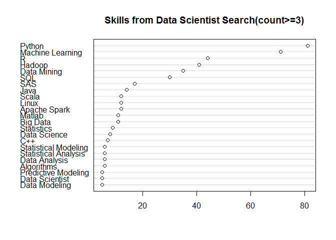
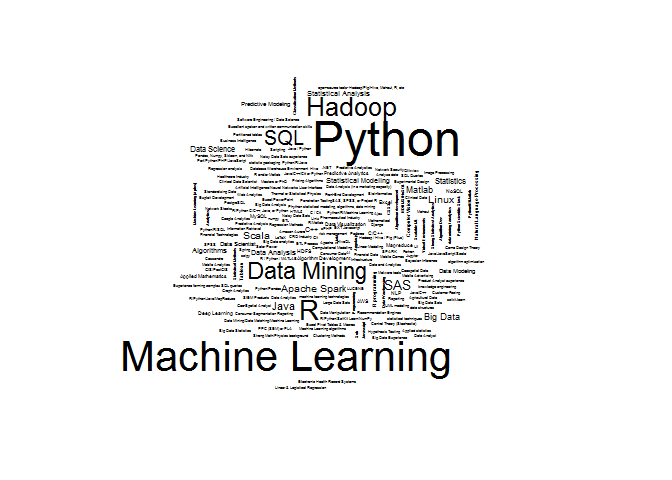
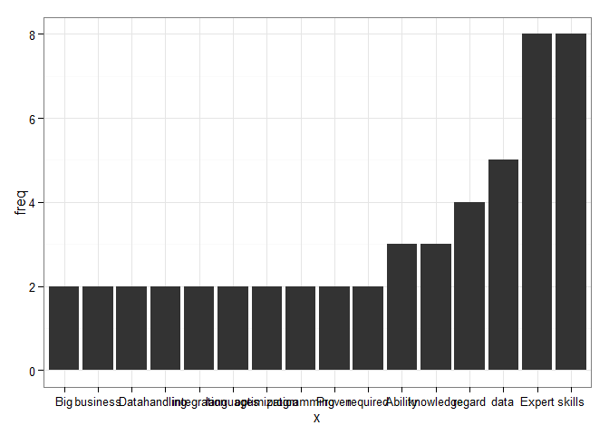

# DSS Project 2
John Weng  
November 6, 2015  

The purpose of this case study is to explore the basic skill of 'data sciencentist', through online job postings for under the search term. The assumption is that we can use the job tags that employers post for data scientists to define what a data scientist does (and thereby arrive at most requested skills of data science as a discipline).

Below are the required R packages needed:


```
## Loading required package: bitops
## Loading required package: RColorBrewer
```

To begin, we want to get a better idea of the search we are conducting at cybercoder.com. First, txt1 will obtain the webpage code for first search result page. From there we will want to see how many postings, pages, and the URLs for each job sites.

```r
txt1 = getForm("http://www.cybercoders.com/search/", searchterms = "Data Scientist",
              searchlocation = "",  newsearch = "true", sorttype = "")
```
'doc1' is then set to orgniaze the webcode from txt1. 'links' will return the URL links for the the job sites on the first page. Because the maxium  number of job posting per page is twenty, there twenty sites' url in link. 

```r
doc1 = htmlParse(txt1, asText = TRUE)
links = getNodeSet(doc1, "//div[@class = 'job-title']/a/@href")
```

As of the set time below, there are 'job.n' number of search results for "Data scientist"

```r
# number of  jobs postings
Sys.time()
```

```
## [1] "2015-11-08 17:32:25 CST"
```

```r
jobs.n <- as.integer(xpathApply(doc1, "//div[@data-totalresults]", xmlGetAttr, "data-totalresults"))
jobs.n
```

```
## [1] 146
```
'page.n' returns the number of pages used to list all the jobs.

```r
page.n <- as.integer(xpathApply(doc1, "//div[@data-maxpages]", xmlGetAttr, "data-maxpages"))
page.n
```

```
## [1] 8
```

To get to all the job information, url_list is created, for do-loop purposes, to obtain page code for each of the 'page.n' search pages. The 'for' loop created each i in txt[[i]] for each of the search pages.  

```r
i<-c(1:page.n)
url_list <- paste('http://www.cybercoders.com/search/?page=',i,sep='')
url_list <- unlist(url_list)

doc<- vector("list", page.n)
for(i in 1:page.n){
  txt<-getForm(url_list[i], searchterms = '"Data Scientist"',
                    searchlocation = "",  newsearch = "true", sorttype = "")
  doc[[i]] <- htmlParse(txt,asText = TRUE)
}
```

To get each individual search for url

```r
linksk <- vector("list",page.n)
joblinks<- vector("list",page.n)

for (i in 1:page.n) {
  linksk[[i]] <- getNodeSet(doc[[i]], "//div[@class = 'job-title']/a/@href")
  joblinks[[i]] <- getRelativeURL(as.character(linksk[[i]]), "http://www.cybercoders.com/")
}
joblinks[[2]]
```

```
##                             /data-scientist-job-233385 
## "http://www.cybercoders.com/data-scientist-job-233385" 
##                             /data-scientist-job-238260 
## "http://www.cybercoders.com/data-scientist-job-238260" 
##                             /data-scientist-job-233874 
## "http://www.cybercoders.com/data-scientist-job-233874" 
##                             /data-scientist-job-147098 
## "http://www.cybercoders.com/data-scientist-job-147098" 
##                             /data-scientist-job-227151 
## "http://www.cybercoders.com/data-scientist-job-227151" 
##                             /data-scientist-job-227159 
## "http://www.cybercoders.com/data-scientist-job-227159" 
##                             /data-scientist-job-227162 
## "http://www.cybercoders.com/data-scientist-job-227162" 
##                             /data-scientist-job-227171 
## "http://www.cybercoders.com/data-scientist-job-227171" 
##                             /data-scientist-job-227174 
## "http://www.cybercoders.com/data-scientist-job-227174" 
##                             /data-scientist-job-227179 
## "http://www.cybercoders.com/data-scientist-job-227179" 
##                             /data-scientist-job-227185 
## "http://www.cybercoders.com/data-scientist-job-227185" 
##                             /data-scientist-job-227196 
## "http://www.cybercoders.com/data-scientist-job-227196" 
##                             /data-scientist-job-229031 
## "http://www.cybercoders.com/data-scientist-job-229031" 
##                             /data-scientist-job-214389 
## "http://www.cybercoders.com/data-scientist-job-214389" 
##                             /data-scientist-job-234497 
## "http://www.cybercoders.com/data-scientist-job-234497" 
##                             /data-scientist-job-237186 
## "http://www.cybercoders.com/data-scientist-job-237186" 
##                             /data-scientist-job-232696 
## "http://www.cybercoders.com/data-scientist-job-232696" 
##                             /data-scientist-job-208486 
## "http://www.cybercoders.com/data-scientist-job-208486" 
##                             /data-scientist-job-204080 
## "http://www.cybercoders.com/data-scientist-job-204080" 
##                             /data-scientist-job-235839 
## "http://www.cybercoders.com/data-scientist-job-235839"
```

Now that the all general urls are know, the next steps gathering all the tags off of the each job sites would be much easier. Though it is possible to get the tags from each job out by each url, the process would take much computer time. Since the tags are already on the search page, all the tag would be gather straight from each page. The tags from each search page are placed in t.tag, and [[]] marking the page number. Here, t.tag[[2]], is a list of tags from page 2.

```r
t.tag <- vector("list", page.n)
for (i in 1:page.n){
  a<-getNodeSet(doc[[i]],"//span[@class='skill-name']")
  t.tag[[i]]<- unlist(sapply(a, xmlValue))
  }

t.tag[[2]]
```

```
##  [1] "Data Analysis"                   "Statistical Modeling"           
##  [3] "algorithm optimization"          "R programming"                  
##  [5] "Python"                          "Python"                         
##  [7] "Excel"                           "SQL"                            
##  [9] "SAS"                             "R"                              
## [11] "Python"                          "R"                              
## [13] "SAS"                             "Stata"                          
## [15] "SPSS"                            "Healthcare Industry"            
## [17] "Data Modeling"                   "knowledge engineering"          
## [19] "UML modeling"                    "Clinical Data"                  
## [21] "Python"                          "Hadoop"                         
## [23] "Scala"                           "Linux"                          
## [25] "Apache Spark"                    "Python"                         
## [27] "Hadoop"                          "Scala"                          
## [29] "Linux"                           "Apache Spark"                   
## [31] "Python"                          "Hadoop"                         
## [33] "Scala"                           "Linux"                          
## [35] "Apache Spark"                    "Python"                         
## [37] "Hadoop"                          "Scala"                          
## [39] "Linux"                           "Apache Spark"                   
## [41] "Python"                          "Hadoop"                         
## [43] "Scala"                           "Linux"                          
## [45] "Apache Spark"                    "Python"                         
## [47] "Hadoop"                          "Scala"                          
## [49] "Linux"                           "Apache Spark"                   
## [51] "Python"                          "Hadoop"                         
## [53] "Scala"                           "Linux"                          
## [55] "Apache Spark"                    "Python"                         
## [57] "Hadoop"                          "Scala"                          
## [59] "Linux"                           "Apache Spark"                   
## [61] "Data Mining"                     "ETL Process"                    
## [63] "Predictive Analysis"             "R"                              
## [65] "Hadoop"                          "Machine Learning"               
## [67] "Natural Language Processing"     "Java"                           
## [69] "Hadoop"                          "Mahout"                         
## [71] "Data Scientist"                  "Big Data Statistics"            
## [73] "Geo-Spatial Analyst"             "Predictive Analystics"          
## [75] "Consumer Segmentation Reporting" "Pharmaceutical Industry"        
## [77] "Bioinformatics"                  "CRO Industry"                   
## [79] "Big Data Analysis"               "R programming"                  
## [81] "Machine Learning"                "NLP"                            
## [83] "Data Mining"                     "Agricultural Data"              
## [85] "Geospatial Data"                 "Deep Learning"                  
## [87] "Python/R/Java"                   "GIS/PostGIS"                    
## [89] "Python"                          "Statistics"                     
## [91] "Machine Learning"                "Statistical Analysis"           
## [93] "Data Visualization"              "Python"                         
## [95] "Big Data"                        "Predictive Modeling"
```
Next, this section combines the all the tags from different pages and assign it to atag. Because all the data is a bit large to dispaly, a count of the top 15 most freqent tags are shown below. 


```r
atag<-c()
for (i in 1:page.n){
      atag <- c(atag,t.tag[[i]])
}

at.count <- count(atag) 
head(at.count [order(at.count[,2], decreasing = TRUE),],15)
```

```
##                    x freq
## 153           Python   80
## 109 Machine Learning   73
## 160                R   45
## 84            Hadoop   39
## 51       Data Mining   34
## 189              SQL   30
## 175              SAS   15
## 95              Java   13
## 14      Apache Spark   12
## 20          Big Data   12
## 107            Linux   12
## 177            Scala   12
## 119           Matlab   10
## 54      Data Science    9
## 198       Statistics    9
```

```r
tab.atag <-table(atag)
```

**Visiualization**

The dotchart only display the value with counts above five.
For the world cload, the margin have been adjusted so there won't be any unploted words. Namely, ' Machine learning' often gets rejected for its' high frequency and long text. 

```r
dotchart(sort(tab.atag[(tab.atag)>=5]),main="Skills from Data Scientist Search(count>=3)",)
```

```
## Warning in dotchart(sort(tab.atag[(tab.atag) >= 5]), main = "Skills from
## Data Scientist Search(count>=3)", : 'x' is neither a vector nor a matrix:
## using as.numeric(x)
```

 

```r
wordcloud(names(tab.atag),tab.atag,scale=c(3,.2),min.freq=1)
```

 


**Previous simi-completed**

This last next page only to show that prior to the assignment change another project is already in the works. Some work have been lost due to some confusing with objective of the assignment. I originally did the search on the stackover 

flow but the visionaliztion is pretty disaponting, since most of the gathered words are very common words
**title 1**


```r
library("ggplot2")
url2 <- "http://careers.stackoverflow.com/jobs/97977/"
cydoc2 <- htmlParse(url2)
```

Job title

```r
las1 <- getNodeSet(cydoc2,"//a[@class = 'title job-link']")
sapply(las1, xmlValue)
```

```
## [1] "(Senior) Data Scientist"
```
Listing the tag

```r
lis2 <- getNodeSet(cydoc2,"//div[@class = 'tags']//a[@class = 'post-tag job-link']")
sapply(lis2, xmlValue)
```

```
## [1] "c++"    "r"      "python" "hadoop" "sql"
```


```r
asWords =
  function(txt, StopWords = readLines("http://jmlr.csail.mit.edu/papers/volume5/lewis04a/a11-smart-stop-list/english.stop"), stem = FALSE){
    words = unlist(strsplit(txt, '[[:space:]!.,;#:()/"]+'))
    words = words[words != ""]
    if(stem && require(Rlibstemmer))
      words = wordStem(words)
    i = tolower(words) %in% tolower(StopWords)
    words[!i]
  }


cy.Words2 = function(u, stopWords = StopWords, doc = htmlParse(u)){
  words = xpathApply(doc, "//div[@class='description']/ul",
                     function(x ) asWords(xmlValue(x)))
  words[[2]]
}
```

getting skills from "skills & requirements"

```r
a2 <- unlist(cy.Words2(url2))
a3 <- cy.Words2(a2)

kk2 <- as.data.frame(count(a2))
```
Count of the words with more a count of 2, or the list is pretty long

```r
kk2 <-kk2[which(kk2$freq >= 2),]
kk2
```

```
##               x freq
## 4       Ability    3
## 14          Big    2
## 15     business    2
## 23         data    5
## 24         Data    2
## 30       Expert    8
## 34     handling    2
## 38  integration    2
## 40    knowledge    3
## 41    languages    2
## 52 optimization    2
## 58  programming    2
## 60       Proven    2
## 64       regard    4
## 65     required    2
## 68       skills    8
```

```r
kk2$x<- factor(kk2$x, levels = kk2$x[order(kk2$freq)])
```
graphic count 

```r
ggplot(kk2,aes(x=x, y=freq)) + theme_bw() + geom_bar(stat='identity')
```

 
about Gfk 4

```r
las2 <- getNodeSet(cydoc2,"//div[@class = 'description'][3]/p")
sapply(las2, xmlValue)
```

```
## [1] "Having choices is what makes life exciting. Make your choice today and take your future into your own hands. We value skills and talents, and will support your development within our international teams. GfK makes your choice easy as we offer an exciting work environment that brings people together and encourages an entrepreneurial and innovative spirit. As a trusted leader in market research present in over 100 countries, we know what makes consumersâ<U+0080><U+0099> hearts beatâ<U+0080><U+0094>globally and locally. We work on projects for successful companies in virtually every major industry."
```
location 5

```r
las3 <- getNodeSet(cydoc2,"//span[@class = 'location']")
sapply(las3, xmlValue)
```

```
## [1] "\r\n                        Nuremberg, Germany\r\n                        (relocation offered)                        (visa sponsorship offered)                    "
```
benifts 6

```r
las4 <- getNodeSet(cydoc2,"//div[@class = 'benefits-list']//span[@class = 'benefit-desciption']")
sapply(las4, xmlValue)
```

```
## [1] "Competitive salary"          "Attractive vacation scheme" 
## [3] "Excellent employer benefits" "Collective healthcare plan" 
## [5] "Flexible working hours"      "Travel compensation"        
## [7] "Global Learning Programs"
```
